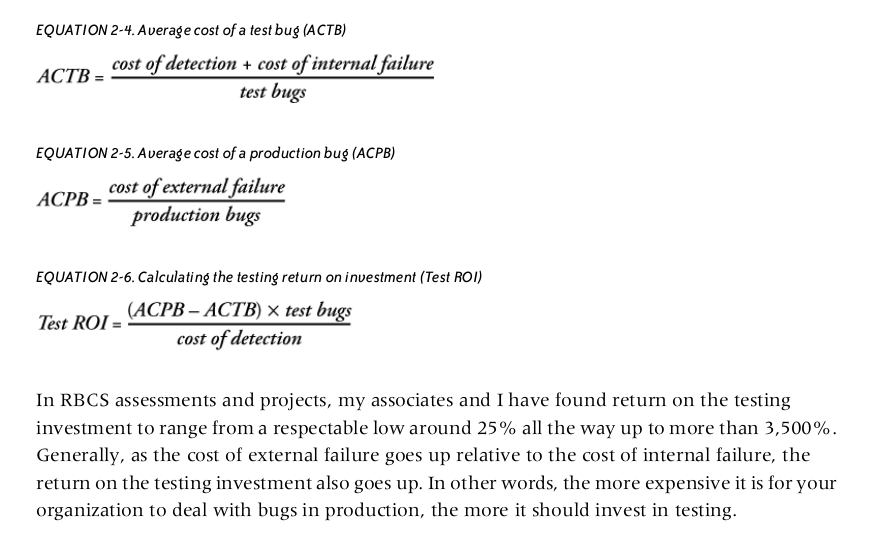

# Clean Code Principles

## Classic software failures

* projects go over budget
* companies spend millions and end up nowhere
* bad software causes fatalities, impacts revenue, and can pose generic risks,
  e.g. security incidents

A 2015 article in IEEE spectrum:

* [Transistor Production Has Reached Astronomical Scales](https://spectrum.ieee.org/computing/hardware/transistor-production-has-reached-astronomical-scales)

Every second of 2014, on average 8 trillion transistors were produced. It is
some software that will run on these.

Robert C. Martin motivation: Let us cleanup ourselves before we are going to be
hit by regulation.

We are living in the age of data, so here's a quip on data and code:

> Code ages like fish, data ages like wine.

## Calculating failure costs

* ROI on testing
* How much time can you invest in testing - or improving code in general?



## Clean code layers (top down)

* Architecture
* Patterns
* Data Structures
* Idiomatic Code

### The right architecture and approach

* rarer, but important decisions
* try to postpone hard questions regarding design
* sometimes [Worse is better](https://en.wikipedia.org/wiki/Worse_is_better)

> Worse is better (also called the New Jersey style) is a term conceived by
> Richard P. Gabriel in an essay of the same name to describe the dynamics of
> software acceptance. It refers to the argument that software quality does not
> necessarily increase with functionality: that there is a point where less
> functionality ("worse") is a preferable option ("better") in terms of
> practicality and usability.

### Useful patterns

* code reuse (i.e. find a suitable library)
* tool reuse ("Taco Bell", [article](http://widgetsandshit.com/teddziuba/2010/10/taco-bell-programming.html))

> The more I write code and design systems, the more I understand that many
> times, you can achieve the desired functionality simply with clever
> reconfigurations of the basic Unix tool set. After all, functionality is an
> asset, but code is a liability. [...] Every time you write code or introduce
> third-party services, you are introducing the possibility of failure into
> your system.

* convention over configuration

### The right data structures

* worry about data structures
* rather 1 data structure and 100 methods than 10 with 10 each

### Idiomatic code (readability)

* make code look boring
* make wrong code look wrong
* Perl ("there is more than one way to do it") to Python ("There should be one–
  and preferably only one –obvious way to do it")
* use the language (to your advantage)

### Cross-cutting concern

Worry about things that are not directly code, like deployment, continuous test
and build processes, etc.

* software lifecycle and support
* CI
* testing
* docs (developer, external, ...)
* setup

## Learn from open source projects

* pragmatic
* efficient
* documented

There is plenty wrong with OSS as well, but successful project can be an inspiration.

* Companies switch (or switched) to basically a common open source workflow
  when they adopted hosted git server applications

## SW engineering's greatest hits

* [Software Engineering's Greatest Hits](https://www.youtube.com/watch?v=HrVtA-ue-x0), [Slides](https://third-bit.com/talks/greatest-hits/#1)

What does research says about software development practices?

* novice errors
* TDD studies
* code metrics

> But nothing works better than counting lines of code

* error handling

> Majority of catastrophic failures could easily have been prevented by
> performing simple testing on error handling code

* exceptions

> Most common catch block logs the error rather than trying to recover from it

And the list goes on.

## Good code properties

There are generic ideas and approaches that have been suggested to improve code
quality.

* Question (Pad):

> Name one you would attribute to describe good code and one to less good code

### Design by contract

* Betrand Meyer, 1980s
* Programming language: Eiffel
* deferred PEP-361 (2003): https://peps.python.org/pep-0316/
* https://github.com/Parquery/icontract

Example: [Snippets/Contracts]

Without specific contract library:

* makeing properties explicit with assertions or explicit checks (and e.g.
  raising `ValueError` on failures)

### Defensive programming

Design to [...] ensure the continuing function of a piece of software under unforeseen circumstances.

This can mean:

* focus on absence of errors
* readable, auditable code
* extra care when dealing with I/O

#### Error handling

* catch specific errors (avoid empty except)
* handle some gracefully
* fail fast

Find the *right level* for your exception.

* reuse existing exception hierarchy: [https://docs.python.org/3/library/exceptions.html](https://docs.python.org/3/library/exceptions.html)

You can include original exceptions via [PEP-3134](https://peps.python.org/pep-3134/) - "Exception Chaining and Embedded Tracebacks"

> Example: [Snippets/ExceptionChaining]

> [...] implicit exception context can be supplemented with an explicit cause by using from with `raise`.

#### Use sensible default values

* across various layers
    * command line flags
    * keyword arguments

Use language facilities, like:

```
dict.get(key, default)
```

### Assertions

* `assert`
* assertions as a last resort (e.g. halt program instead of handling an error)

Can be disable at runtime, e.g. with `python -O script.py`

```python
$ python -c "assert False"
Traceback (most recent call last):
  File "<string>", line 1, in <module>
AssertionError
```

With basic optimizations:

```
$ python -Oc "assert False"
```

### Encapsulation

* module interfaces should be simpler than the implementation

In [Philosophy of Software
Design](https://web.stanford.edu/~ouster/cgi-bin/book.php) Ousterhout reports
various issues in implementations:

* students wrote too many classes for the problem - information leakage between
  classes; e.g. two classes to handle HTTP requests - hence both classes
implemented many aspects of understanding the request data structure

> slightly larger classes could have helped to hide information (details about
> the request) better

### Separation of concerns

#### Avoid adding to many responsibilities

Case study: A DSL coupled with a backend storage system (SM).

### Cohesion and coupling

* cohesion: well defined purpose; coupling: dependency between code
* aim for: high cohesion and low coupling ("oss" - separate parts, ...)

### DRY

* don't repeat yourself
* there is also the *rule of three* - use opportunities to abstract or factor out a piece of code

### YAGNI

* related to TDD a bit
* what you need vs what you want
* some instances: abstracting backends (albeit only one is and will be used)
* any *potential* benefit

> It can be hard to distinguish between design and YAGNI

### KISS

* from aerospace industry

> “Our aim,” he said, “is to get results cheaper, sooner, and better through
> application of common sense to tough problems. If it works, don’t fix it.”
> “Keep it simple, stupid—KISS—is our constant reminder.” -- [Biographical Memoir](http://www.nasonline.org/publications/biographical-memoirs/memoir-pdfs/johnson-clarence.pdf#page=13)

#### Smallest data structure to fit the problem

Quick question:

You are tasked to implement depth-first search on a graph. How could you
implement a graph?

### EAFP and LBYL

Python prefers the style: easier to ask for forgiveness than permission, or EAFP for short.

Example:

```python
data = {
    "a": 1,
    "b": 2,
}

# Works, LBYL style (https://docs.python.org/3/glossary.html#term-lbyl)
if data.has_key("a"):
    v = data["a"]
else:
    do_something_else()

# Better, following EAFP (https://docs.python.org/3/glossary.html#term-eafp)
try:
    v = data["a"]
except KeyError:
    do_something_else()
```


### Composition and inheritance

Example for sensible inheritance:

* socketserver and http packages: [socketserver.py](https://github.com/python/cpython/blob/ecfff63e06e77e22035a7f7caa26986f033f3aea/Lib/socketserver.py#L672-L709), [server.py](https://github.com/python/cpython/blob/main/Lib/http/server.py)

```python

"""
...
There are five classes in an inheritance diagram, four of which represent
synchronous servers of four types:
        +------------+
        | BaseServer |
        +------------+
              |
              v
        +-----------+        +------------------+
        | TCPServer |------->| UnixStreamServer |
        +-----------+        +------------------+
              |
              v
        +-----------+        +--------------------+
        | UDPServer |------->| UnixDatagramServer |
        +-----------+        +--------------------+
...
"""

class HTTPServer(socketserver.TCPServer):

    allow_reuse_address = 1    # Seems to make sense in testing environment

    def server_bind(self):
        """Override server_bind to store the server name."""
        socketserver.TCPServer.server_bind(self)
        host, port = self.server_address[:2]
        self.server_name = socket.getfqdn(host)
        self.server_port = port


class ThreadingHTTPServer(socketserver.ThreadingMixIn, HTTPServer):
    daemon_threads = True
```

A mixin here adds threading functionality (but not more).

#### Inheritance related anti-patterns

* Anemic Domain Model
  * data and related behaviour in two separate classes
* BaseBean (no beans in Python, though)
  * you may inherit from a dictionary to get lookup functionality (rather, use a dictionary)
* Circle-Ellipsis problem (or Square-Rectangle Problem) - violated LSP ([...] It
  is only when derived types are completely substitutable for their base types
  [...])

#### Multiple inheritance and MRO

Python allows multiple inheritance.

* methods are resolved using C3 algorithm

Can make it easy to combine functionality:

```python
class LoggingDict(dict):
    def __setitem__(self, key, value):
        logging.info('Setting %r to %r' % (key, value))
        super().__setitem__(key, value)

class LoggingOrderedDict(LoggingDict, collections.OrderedDict):
    pass
```

#### Mixins

* Mixins do provide partial functionality
* Example: ThreadingMixIn 

### Functions and arguments

* anything that can be derived should not be passed separately (request)
* use the already aggregated object

```python

def f(request.header, request.body):
  pass

def f(request):
  header = request.header
  body = request.body
```

* or use some convential form 

Example:

* instead of `f(filename, fh): pass` you can decide, whether you need the
  filename and file handle as separate parameters

#### Too many arguments lead to higher coupling

* in general, too many arguments lead to higher coupling
* in python, keyword (default) arguments are your friend (example: [pandas.read_csv](https://pandas.pydata.org/docs/reference/api/pandas.read_csv.html))


#### Group parameters

* similar to the request example
* for example config or "option" objects

## Package design

* setup.py

## Packaging options

* linkedin example: shiv

### Automation with gitlab

```yaml
# git push sc master => runs CI
#
# git tag v0.1.2
# git push sc --tags => creates package and uploads to Nexus

image: python:3.9.6-slim-buster

stages:
  - test
  - deploy

before_script:
   - pip install --upgrade pip
   - pip install pytest twine

tests:
  stage: test
  script:
    - pip install backports.csv # try installing this from pypi, nexus may not like the [.]
    - python setup.py develop --index-url $PYPI_PROXY_URL # faster, less load for pypi
    - pytest
  tags: [docker]
  except:
    - tags

upload_to_nexus:
  stage: deploy
  variables:
    TWINE_USERNAME: $NEXUS_USERNAME
    TWINE_PASSWORD: $NEXUS_PASSWORD
  script:
    - python setup.py sdist
    - twine upload --repository-url $NEXUS_REPOSITORY_URL dist/*
  only:
    - tags
  tags: [docker]
```

## Task: Find ways to improve code

This is a basic Tic-Tac-Toe implementation, but it can be improved:

```python

"""
Task: Find potential improvements in the following code. Name them and suggest an alternative.

Code implements a basic TicTacToe game.
"""

import random


def check(game):
    if '.' not in game:
        return True
    if game[0] == game[1] and game[1] == game[2] and game[0] != '.':
        return True
    if game[3] == game[4] and game[4] == game[5] and game[3] != '.':
        return True
    if game[6] == game[7] and game[7] == game[8] and game[6] != '.':
        return True
    if game[0] == game[3] and game[3] == game[6] and game[0] != '.':
        return True
    if game[1] == game[4] and game[4] == game[7] and game[1] != '.':
        return True
    if game[2] == game[5] and game[5] == game[8] and game[2] != '.':
        return True
    if game[0] == game[4] and game[4] == game[8] and game[0] != '.':
        return True
    if game[2] == game[4] and game[4] == game[6] and game[2] != '.':
        return True
    return False


def print_board(board):
    print()
    print(board[0] + board[1] + board[2])
    print(board[3] + board[4] + board[5])
    print(board[6] + board[7] + board[8])


def tic_tac_toe(board, player):
    while True:
        if not check(board):
            if player == 'x':
                pos = int(
                    input("[{}] your move [0-8]? ".format(player))
                )
            else:
                pos = random.randint(0, 8)
            if board[pos] == '.':
                board[pos] = player
                if player == "x":
                    player = "o"
                else:
                    player = "x"
                print_board(board)
        else:
            return


if __name__ == "__main__":
    board = ['.' for _ in range(9)]
    tic_tac_toe(board, "x")

```