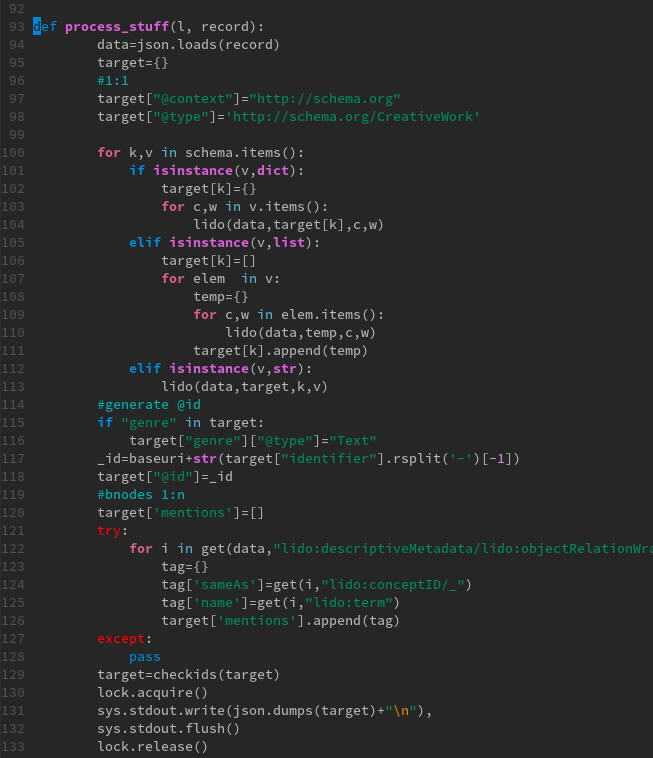

# Clean Code Continued

## Coding Guidelines

* I remember a time, when coding styles were something special. There was
  Checkstyle for Java (first released in 2001).
* Around the same time PEP8 was created (on 05-Jul-2001).

> PEP stands for Python Enhancement Proposal; The first PEP, PEP1, describes the process.

> A PEP is a design document providing information to the Python community, or
> describing a new feature for Python or its processes or environment.

Over 500 PEP has been suggested since then (PEPs are numbered, although with gaps).

Other notable PEPs are:

* [PEP 20 -- The Zen of Python](https://www.python.org/dev/peps/pep-0020/)
* [PEP 257 -- Docstring conventions](https://www.python.org/dev/peps/pep-0257/)
* [PEP 3000 -- Python 3000](https://www.python.org/dev/peps/pep-3000/)


### PEP 8 -- Style Guide for Python Code

> One of Guido's key insights is that code is read much more often than it is
> written. The guidelines provided here are intended to improve the readability
> of code and make it consistent across the wide spectrum of Python code.

Every rule has exceptions.

> However, **know when to be inconsistent** -- sometimes style guide
> recommendations just aren't applicable. **When in doubt, use your best
> judgment**. Look at other examples and decide what looks best. And don't
> hesitate to ask!

### PEP8 condensed

#### Layout

* use 4 spaces (tabs, however, increase accessible e.g. for visually impaired programmers)
* indent consistently (Python 3 disallows mixing the use of tabs and spaces for indentation)

You can go further by using a tool like
[editorconfig](https://editorconfig.org/) to communicate a standard.

* continuation alignment ([examples](https://www.python.org/dev/peps/pep-0008/#indentation))
* maximum of 79 chars per line, and use continuation to break up lines or backslashes (note: I've seen this rule ignored often)
* lines should break before a binary operator ([example](https://www.python.org/dev/peps/pep-0008/#should-a-line-break-before-or-after-a-binary-operator))
* blank lines: 2 around classes and top level functions; one around methods; sparingly inside functions
* code should be written in UTF-8
* imports should be on separate lines
  ([example](https://www.python.org/dev/peps/pep-0008/#imports)), and always on
top of the file; in the best case they follow an order (stdlib, 3rd-party,
local).

> There is a tool called [isort](https://github.com/PyCQA/isort) that allows
> you to sort imports.

```python
$ cat unsorted.py
import re
import csv
import pandas as pd

```

Check the ordering.

```shell
 isort -c unsorted.py
ERROR: ... Snippets/SortImports/unsorted.py
    Imports are incorrectly sorted and/or formatted.
```

Dry run with `-d` flag:

```shell
$ isort -d unsorted.py
import csv
import re

import pandas as pd
```

* prefer absolute imports and simple package layouts
* put "module level dunder" names after docstring, before imports (except future special import)

#### String Quotes

* both single and double quotes are allowed, use consistently

#### Whitespace

* various considerations around whitespace; [examples](https://www.python.org/dev/peps/pep-0008/#whitespace-in-expressions-and-statements)

#### Trailing commas

```python
FILES = ('setup.cfg',)
```

It would be syntactically correct to remote the parentheses, but they are left
for clarity.

In lists, the last value can (and should) have a comma, too:

```python
FILES = [
    'setup.cfg',
    'tox.ini',
    ]
```

#### Comments

> Comments that contradict the code are worse than no comments. Always make a
> priority of keeping the comments up-to-date when the code changes!

That is both an important and hard rule to follow. You have to think about
documentation as something equally important as code. It helps to **re-read** code
and fix issue incrementally.

----

Sidenote: Motivation and Documentation

Armin Ronacher, a long time active member of the Python community remarked that
documentation should look good. So good, that you want to write more of it, or
make it even clearer. There are a couple of documentation framework that can
help with that.

----

> Comments should be complete sentences. The first word should be capitalized,
> unless it is an identifier that begins with a lower case letter.

----

Sidenote: Comments and documentation can be a topic of discussion.

More than once I heard:

> Nobody will use my code, I do not need comments.

True, and often realistic. But is it enough to skip it altogether? Maybe you
are working on different project and after two years you come back to old,
undocumented code - your code can get foreign (even to yourself) soon.

I think there are reasons to skip e.g. documentation entirely, you want a
throwaway prototype or something similar.

----

* no inline comments, unless specific

```python
x = x + 1                 # Increment x
```

Comments can distract, but might add context.

```
x = x + 1                 # Compensate for border
```

### Other

PEP8 talks about names, and as they are important, let's move them to a
separate section.

## Naming Conventions

Let's first pin down a few general prinicples.

We name variables, functions, classes, modules, packages. Good names ease
understanding, less good names obstruct, or even mislead. Remember that code is
read 90% of the time, so considering sensible names is important.

### Reveal your intent

The following code snippet does not reveal its intent.

```python
def get_it():
    list1 = []
    for x in the_list:
        if x % 4 == 0:
            list1.append(x)
    return list1
```

* *implicity* of code
* the zen of python states (line 2): explicit is better then implicit

Trying to be explicit is an act of communication.

### Distinct names

* you will find fewer of these names in Python, but
  `XYZControllerForEfficientHandlingOfStrings`,
`XYZControllerForEfficientStorageOfStrings` are not distinct enough

### Meaningful distinctions

It happens that you have more of one thing and you end up with variable names
like: `a1`, `a2` and so on.

Typically, there is a better way to write this by grouping similar items in a
container like list or dictionary.

```python
transforms = [a, b, c]
```

What has been `a1` will become `a[0]` and so on.


----

Sidenote: Intents

* read own code and other peoples code
* good variable names make comments obsolete
* use constructs with intent

As an example for intent, sometimes you can choose between a list and tuple. A
tuple signals immutability to a reader, while functionally using a list or tuple
might be equivalent.

You can use a list and check, if an element is already in there. But Python has
a built-in `set` data type that conveys this exact meaning.

A program can have an exit code (e.g. important when used in scripts). It is a
fine detail, but these exit codes can convey meaning (some programs, e.g. like
wget use a range of exit codes that you can quickly lookup, which is helpful for
debugging).

Example: [Snippets/Unique](Snippets/Unique)

----

### Avoid noise

Other languages (e.g. Go) are being explicit about this, although Python has a
more flexible import system.

```python
class Product:

    def __init__(self):
        self.product_info = {}
        self.product_data = {}

product = Product()
product.product_info # XXX: too noisy
...
```

Noise slows us down. Imaging you encounter two classes, e.g.:

* Customer
* CustomerObject

Which one do you choose? Every decision we open up to the reader to figure out
him or herself can be a potential time sink as the reader needs to establish
the context first, by reading code, reading documentation, asking a colleague
and so on. Something that should have taken a minute, takes hours or days.

### Use pronouncable names

* `modymdhms` is hard to spell out and (without autocomplete) easy to get wrong

### Use searchable names

Code is read more often that it is written and finding relevant code is important.

* Rule: The length of a name should correspond to the size of its scope

When using the command line, `grep -r` and `ack` are your friends.

### Avoid mental mapping

We see this over and over again: clean code relates to reducing the *cognitive load*.

----

> But programmers are smart and juggle many things in their head at any point in time, no?

> Yes, they are and do. But clarity is king.

----

* a name that does not need a (semantic) translation reduces cognitive load

### Don't be cute

* since you can use any name, why not spice up names

```python
def make_me_a_sandwich(user):
    """ Grants user admin privileges. """
    ...
```

* do not do it, keep it boring, `set_admin_privileges(user)`.

### Use one word per concept

* fetch, retrieve, get - what is the difference?
* you are again making the reader think (which you want, but also do not want)
* if I see method names using fetch, retrieve and get used for similar things,
  I will start to try to understand what exactly this difference is made of -
which takes away time

Other examples:

* controller, manager, driver
* transform, process, modify, ...


### Use solution domain names

There will usually be a specific technical term, that has

```python
def enqueue_task(task):
    ...

def handle_websockets(conn):
    ...

def dfs(node):
    ...
```

### Use problem domain names

When no technical term fits the bill, names from the problem domain should be used.

```
def edge_detect(img):
    ...
```

## Naming Conventions according to PEP8

In the context of PEP8.

* aspirational, should be considered, but ok to miss, when code exists that
  follows a different style

### Regarding noise

> The X11 library uses a leading X for all its public functions. In Python,
> this style is generally deemed unnecessary because attribute and method names
> are prefixed with an object, and function names are prefixed with a module
> name.

```python
import os

if os.path.exists("filename"):
    pass
```

An exception is `os.stat` which returns (the C equivalent of a) namedtuple
(PyStructSequence); here all fields are prefixed by `st_`, e.g. `st_mode`,
`st_size` (see: [https://git.io/JUbO5](https://git.io/JUbO5)).

### Names to avoid

Single character variables names:

* `l`, `O`, `I`

### Module names should be short

Excluding some files, there are about 800 python files in the Python distribution.

<!-- find . -name "*py" | grep -v "lib2to3" | grep -v "test_" | grep -v "/test"
| grep -v "__init__.py" | wc -l -->

* around 20% of the module names have an underscore in it (see sample)

```shell
mac_greek.py
text_file.py
import_diagnostics.py
mac_croatian.py
build_scripts.py
popen_fork.py
iso8859_14.py
find_max_nesting.py
iso8859_2.py
asdl_highlight.py
```

### Class Names

* should use the `CapWords` convention

### Exceptions

* should be written with `CapWords` as classed, but have `Error` appended
* Example: `ClassificationError`

### Global variable names

* try to avoid them; the can make reasoning about functions that use them much harder

If you use them on a module level, use the `__all__` mechanism to explicitly
name exported names.

### Function and variable names

> Function names should be lowercase, with words separated by underscores as
> necessary to improve readability.

> Variable names follow the same convention as function names.

> mixedCase is allowed only in contexts where that's already the prevailing
> style (e.g. threading.py), to retain backwards compatibility.

### Function and method arguments

> Always use **self** for the first argument to instance methods.

> Always use **cls** for the first argument to class methods.


### Instance variables

* use a leading underscore only to for non-public methods and instance variables
* there are not visibility modifiers in Python, so access will still be possible

### Constants

* typically `ALL_UPPERCASE`

### Design for inheritance

Some ideas to keep in mind in context of object oriented programming.

* start with non-public methods, if unsure; as a public API might mean commitment
* or otherwise make clear that an API is not fixed yet

Attribute access.

> For simple public data attributes, it is best to expose just the attribute
> name, without complicated accessor/mutator methods.

* keep functional aspect (e.g. via properties) side-effect free
* no computationally expensive operation in a property (the attribute access
  signals a relatively fast operation)

Try to design classes to be subclasses in a way, that reduces the need to hide
data to a minimum. There is a name-mangling rule in Python.

```python
class A:
    def __init__(self):
        self.name = "any"
        self.lang = "python"

class M:
    def __init__(self):
        self.__name = "any"
        self.__lang = "python"

class B(A):
    def hello(self):
        print(self.name)

class C(M):
    def hello(self):
        print(self.__name)

b = B()
c = C()

b.hello()
# c.hello() # AttributeError
```

### Private and public interfaces

> To better support introspection, modules should explicitly declare the names
> in their public API using the `__all__` attribute. Setting `__all__` to an
> empty list indicates that the module has no public API.

## Clean Code rules and principles

Care in small things will add up. Ergonomically, it might be easier to focus on
a little improvement at a time.

Some guiding principles:

* write small functions
* use descriptive names
* use boolean flags as little as possible
* minimize side effects
* do one thing
* do not repeat yourself

----

Sidenote: A Python snippet from the web



* [Snippets/Lido](Snippets/Lido)

Again, use the etherpad.

> Question: Name a few issue with this code.

You can read the code here as well:

* https://gist.github.com/miku/dce655ebbfb7218760af4c8c60f47629#file-example-py-L93-L133
* https://git.io/JUNMr

----

## SOLID Principles

Principles for design. Managing dependencies (between components) - how change
propagates to a system. There can be similar concerns expressed for data (e.g.
dependencies of data artifacts).

### Single Responsibility Principle (SRP)

* SRP: a class should have one and only one reason to change - reported in
  Philosophy of Software Design as a typical error (e.g. HTTP request library)

### Open/closed principle (OCP)

* you should be able to extend a class's behaviour without modifying; a
  compositional pattern

Typically done by subclassing a base class.

* we extend the behaviour
* we reuse methods of the superclass
* the superclass is completely unaware of its subclasses

If the superclass changes its behaviour, it will affect the subclasses.

* another way is to extract interfaces and supply different implementations
* an interface is declarative, does not supply implementation and hence subclasses will not be coupled to a specific superclass implementation detail

In Python, explicit interfaces are rarely seen.

* You can define a class to be subclassed and provide no implementation.

Example: [Snippets/AbstractClass](Snippets/AbstractClass)

The standard library supports the implementation of a number of standard
interfaces in the
[collections.abc](https://docs.python.org/3/library/collections.abc.html)
module.

### Liskov substitution principle (LSP)

* Objects of a superclass shall be replaceable with objects of its subclasses
  without breaking the application.

Example of a not following this rule: [Liskov](Snippets/Liskov)

### Interface Segregation Principle (ISG)

* No client should be forced to depend on method it does not use ()
* keep interfaces small

In Python, we have duck-typing. You can pass any object to a function, as long
as it "responds" to a method, it satisfies an *informal* interface.

* Example: [Reader](Snippets/Reader)

### Dependency Inversion Principle (DIP)

* High-level modules should not depend on low-level modules. Both should depend on abstractions (e.g. interfaces).
* Abstractions should not depend on details. Details (concrete implementations) should depend on abstractions.

A typical design approach is bottom-up: Write lower level components first, then
build abstractions on top of them, directly. This can lead to coupling, as a lower level module might not easily changed.

By introducing an abstraction, a user and provider of functionality can be
decoupled.

* Example: [DependencyInversion](Snippets/DependencyInversion)

Note: Dependency Injection is a debated topic in Python. [Why is IoC / DI not
common in
Python?](https://stackoverflow.com/questions/2461702/why-is-ioc-di-not-common-in-python).

Quoting James Shore:

> "Dependency Injection" is a 25-dollar term for a 5-cent concept. [...]
> Dependency injection means giving an object its instance variables. 

## Generic rules

* KISS (keep it simple, solid), aka "flintstoning"
* DRY (don't repeat yourself)
* YAGNI (you ain't gonna need it)
* Composition over inheritance (example: logging module in standard library)
* Readability counts (Line seven of Zen of Python) 
* The rule of three 
* Principle of least surprise


A small, but effective tweak.


The rule spelled out:

> Let the happy path flow down the left hand edge.

If necessary invert conditions to keep reduce indent.

```python
if json_obj is not None:
    authors = json_obj.get("author")
    if authors is not None:
        for author in authors:
            orcid = self.om.normalise(author.get("ORCID"))
            if orcid is not None:
                result.add(orcid)

```

----

Task: Apply the "happy path" rule to the snippet above.

* [https://github.com/opencitations/index/commit/09af4a174c0a6dbcf4a838550b5ad558fc3dcee6](https://github.com/opencitations/index/commit/09af4a174c0a6dbcf4a838550b5ad558fc3dcee6)


## Patterns and anti-patterns in Python

Patterns and anti-patterns.

### Avoid global

A global variable can potentially be altered from many places and can complicate
code comprehension.

* avoid the `global` keyword

----

Sidenote: On a higher level, the essay/paper "Out of the tar pit" (2006) talks
about common problems in software construction.

One key observation is that state, and keeping track of state.

> The biggest problem in the development and maintenance of large-scale software
> systems is complexity — large systems are hard to understand. We believe that
> the major contributor to this complexity in many systems is the handling
> of state and the burden that this adds when trying to analyse and reason about
> the system.


----

### Avoid mutable default values

A source of bugs is the following snippet:

```python
def fun(a=1, b=[]):
    b.append("x")
    print(b)


fun()
fun()
```


The alternative is to use `None` as a default:

```python
def fun(a=1, b=None):
    if b is None:
        b = []
    b.append("x")
    print(b)
```

### EAFP

Python prefers the style: easier to ask for forgiveness than permission, or EAFP for short.

Example:

```python
data = {
    "a": 1, 
    "b": 2,
}

# Works, LBYL style (https://docs.python.org/3/glossary.html#term-lbyl)
if data.has_key("a"):
    v = data["a"]
else:
    do_something_else()

# Better, following EAFP (https://docs.python.org/3/glossary.html#term-eafp)
try:
    v = data["a"]
except KeyError:
    do_something_else()
```

### Classes vs functions

* OOD and OOP emphasize classes (and some languages require them)
* Python is a "multi-paradigm" langauge
* Talk by Jack Dietrich: "Stop writing classes" (reducing hundreds of lines to a few dozens) 


## Test automation and test-driven development

* a school of programming favors a test first approach (or TDD)
* the basic idea: write a failing test first, then write code to make it pass (and only to make it pass)

Example: [Snippets/TestDriven](Snippets/TestDriven)

## Refactoring tools

* typically supported by IDEs, such as PyCharm
* rename, invert boolean, ...

## Code metrics

* tokei; sloccount
* pylint

## Detecting fragile code

* cyclomatic complexity

## Balanced Toolset

More tools:

* pyflakes
* mypy and type hints - Example: [Snippets/Mypy](Snippets/Mypy)

```
$ mypy Snippets/Mypy/hints.py 
Success: no issues found in 1 source file
``` 

* pycodestyle (formerly pep8)

Example output:

```python
$ pycodestyle --first siskin
siskin/__init__.py:43:80: E501 line too long (80 > 79 characters)
siskin/conversions.py:136:24: E741 ambiguous variable name 'l'
siskin/mab.py:168:12: E713 test for membership should be 'not in'
siskin/mappings.py:82:1: E265 block comment should start with '# '
siskin/test_arguments.py:52:27: E711 comparison to None should be 'if cond is None:'
siskin/test_utils.py:140:26: E712 comparison to True should be 'if cond is True:' or 'if cond:'
siskin/utils.py:96:9: E731 do not assign a lambda expression, use a def
siskin/utils.py:566:29: W605 invalid escape sequence '\d'
siskin/assets/161/161_marcbinary.py:27:5: E722 do not use bare 'except'
siskin/assets/101/101_marcbinary.py:60:15: W291 trailing whitespace
siskin/assets/183/183_marcxml_sru.py:100:72: E262 inline comment should start with '# '
```

Enforcing code styles.

* black
* yapf

The latter can be configured.

```
$ cat .style.yapf
[style]

based_on_style = pep8
split_before_logical_operator = true
column_limit = 160
```

## Elements of agile programming

Agile programming tries to take on a different perspective on software
development, shifting emphasis.

* Individuals and interactions over processes and tools
* Working software over comprehensive documentation
* Customer collaboration over contract negotiation
* Responding to change over following a plan

Value feedback and everything that allows you to collect feedback more easily.

----

Sidenote: A way to get to feedback.

Working on a plugin project for a application, that was slowly loading. Every
invocation (e.g. manual test) required to wait about ten seconds and would
involve a couple more manual steps. Doable, but annoying.

Solution: Factor out the bare minimum to execute the code (e.g. the plugin
loader) plus add some preloading.

Result: feedback time went from a minute to two seconds, development speed and
motivation did not decline.

----

## Learning from successful open source projects

* reading popular source repositories
* reading the standard library

Open source has various pragmatic aspects:

* time constrained development
* a wide range of contributions (developers of various levels, code,
  documentation, bug reports, pull requests, ...)

## Deconstructing complex code

* no single approach
* start or extend documentation
* extract (common) functions
* extract shared code into an independent library
* if they do not exist, write tests for functions
* try to find existing libraries that implement functionality

----

What do you think?

> Question: Which approach or technique of clean code do you find easily
applicable? Which one not?

