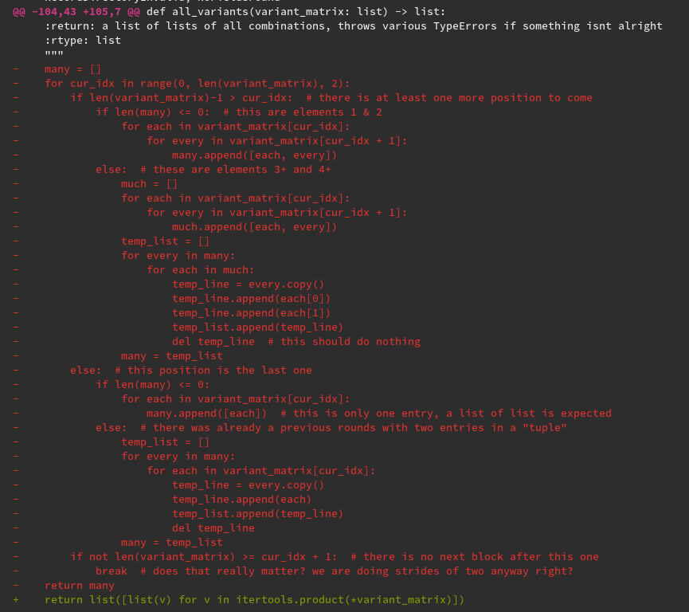

# Itertools

> The module standardizes a core set of fast, memory efficient tools that are useful by themselves or in combination.

As the docs say:
    


Various types of functions:
    
* Infinite iterators
* Iterators terminating on the shortest input sequence
* Combinatoric iterators


## Task

Implement a truth table printer for an arbitrary boolean expression. Something
that looks like this. In the best case, the formula can be any valid boolean
formula.

You may find [itertools](https://docs.python.org/3/library/itertools.html)
useful, and maybe also
[str.maketrans](https://docs.python.org/3/library/stdtypes.html#str.maketrans)
as well as [eval](https://docs.python.org/3/library/functions.html#eval).

Examples:

```shell
not (A and B)
-------------
not (0 and 0) | 1
not (0 and 1) | 1
not (1 and 0) | 1
not (1 and 1) | 0
```

Or:

```shell
not ((not (A and B)) and (not (A and B)))
-----------------------------------------
not ((not (0 and 0)) and (not (0 and 0))) | 0
not ((not (0 and 1)) and (not (0 and 1))) | 0
not ((not (1 and 0)) and (not (1 and 0))) | 0
not ((not (1 and 1)) and (not (1 and 1))) | 1
```

Online-Tools: https://web.stanford.edu/class/cs103/tools/truth-table-tool/

