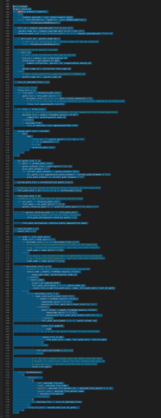

# Refactoring

Why change code at all:

* feature
* bugfix
* better design
* optimization

## Business Case

* better code is easier to maintain
* you can spend a day or a week or a month on refactoring
* there has to be a business case, too
    * cannot spend a year on code that will be phased out in two years
    * cannot spend a year improving design while features are waiting
* compromise: reserve one day just for retroactive improvements
    * improvement can take longer, but try to make a tiny progress in each session
* if your business is growing, then business case for more change it there
    * product will exist ten years from now

## Technical Debt

A probably useful metaphor for understanding accumulated issues in projects.

* deadlines
* no tests
* insufficient documentation
* change of requirements

## Optimize for learning

* try to postpone decisions
* the later you have to decide, the more informed your decision will be

## API design

* once your API is clear, and you have a test harness, refactoring becomes a breeze

> Exercise: Please refactor the following piece of code. We want to make it a
> bit more performant [...] - one example with another without tests

Examples of great API designs:

* scikit-learn
* keras (beat tensorflow)

## What is a change?

Examples:

* [x] adding a function
* [x] removing a function
* [x] changing a function

## Why not change?

* hard, not sure if something breaks
* touches many parts

## Before you refactor

Maybe this can save some time: [https://github.com/97-things/97-things-every-programmer-should-know/blob/master/en/thing_06/README.md](https://github.com/97-things/97-things-every-programmer-should-know/blob/master/en/thing_06/README.md)

* the best approach for restructuring starts by taking stock of the existing codebase and the tests written against that code. 
* avoid the temptation to rewrite everything
* many incremental changes are better than one massive change

> side note: git add/reset -p is made for that

* after each iteration, it is important to ensure that the existing tests pass.
* personal preferences and ego shouldn't get in the way
* new technology is insufficient reason to refactor
* remember that humans make mistakes

I would add:

* co-ordinate with team (and maybe author) before refactoring

## A few problems

### Code bloat

* long methods
* large classes
* primitive obsession
* long parameter list



### Change preventers

* divergent change (changes across many different methods)

### Dispensables

* comments
* duplicate code
* dead code
* speculative generality

### Couples

* feature envy (object access data of another object more than its own)
* middle man (a thin class, mostly delegating to another)
* message chains (like `a.b.c.d()`)

## A few techniques

### Improve methods

* extract methods
* inline
* move
* rename

### Remove dead code

* identify unused code
* mostly after implementation of larger features

### Decompose Conditional

* make conditionals easier to read

```python
if date.before(SUMMER_START) or date.after(SUMMER_END):
    charge = quantity * winterRate + winterServiceCharge
else:
    charge = quantity * summerRate

# better

if isSummer(date):
    charge = summerCharge(quantity)
else:
    charge = winterCharge(quantity)

```

* remove control flags (use break or continue instead)
* quick poll: anyone used `for ... else` in Python?


### Introduce Null Object

```python
if customer is None:
    plan = BillingPlan.basic()
else:
    plan = customer.getPlan()

# better

class NullCustomer(Customer):

    def isNull(self):
        return True

    def getPlan(self):
        return self.NullPlan()

    # Some other NULL functionality.

# Replace null values with Null-object.
customer = order.customer or NullCustomer()

# Use Null-object as if it's normal subclass.
plan = customer.getPlan()
```


### Parameterize Function

* after two or more special cases, a parameter may be approriate

```python
def run_once():

def run_twice():

# better

def run(n=1):
```

### Introduce Parameter Object

* group related values into an own object

### Hide Delegate

> If a caller uses object A to get to object B and the called explicity call
> object B - then maybe delegate calls to B from A - so the caller only deals
> with a single object.q

### Encapsulate Collection

* instead of exposing a collection, add methods and encapsulate details


## Some notes from Refactoring to Patterns

* overengineering happens

> because programmer do not want to be stuck in a bad design

> But over time the power of patterns led me to lose sight of simpler ways to
> write code.

Ex: strategy vs. a simple conditional

Then: Underengineered software. Can cause pain as well.

* everything talks to everything else (e.g. no layers, little abstraction, ...)

At some point you consider a total rewrite.

> TDD and continuous refactor

Two XP practices.

* TDD: Ask, Respond, Refine; Test case, code, rewrite case, repeat

Or, Kent Back:

* red, green, refactor


## Task: Code with some issues


```python

"""
The following code has some issues, find them and try to correct them.

Note: This class does not have tests (no need to add any for the moment).
However, real refactoring should be done against tested code.
"""

import json

class Processor:
    
    def __init__(self, data=None, lookup=None):
        self.data = data
        
    def load(self):
        self.loaded = json.loads(self.data)
    
    def filter_by_a(self, records):
        result = []
        for record in records:
            if 'a' in record:
                for value in result:
                    if 'a' in value:
                        break
                else:
                    result.append(record)
        return result

    def filter_by_b(self, records):
        result = []
        for record in records:
            if 'b' in record:
                for value in result:
                    if 'b' in value:
                        break
                else:
                    result.append(record)
        return result
                 
    

data = '[{"a": 1}, {"b": 2}, {"c": 3}, {"a": 4}, {"b": 5}]'
processor = Processor(data=data)
processor.load()
for record in self.filter_by_a(self.loaded):
    print(record)
```