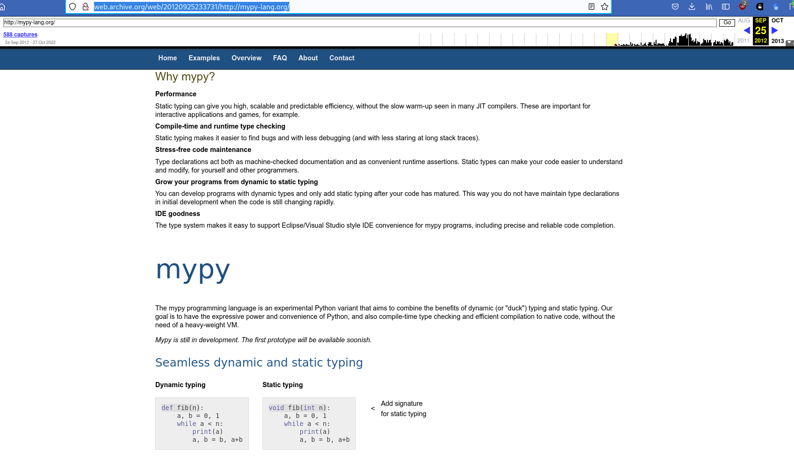

# Gradual Typing (1/n)

An (ongoing) exploration of Python's type system.

> 2022-11-08, 1900 CEST, Leipzig Python User Group

* [Martin Czygan](https://www.linkedin.com/in/martin-czygan-58348842)

---

# Static and Dynamic

Once upon a time, ... there was a great divide between staticly and dynamicly
typed languages.

> I remember [On the Revival of Dynamic
> Languages](https://fatcat.wiki/release/euoa6xqxmzf7te4pfqn5eaj6uu) (2005) on
> my desk at around 2012.

And have fallen in love with a dynamic language just around the time that paper
came out (and I seem to wanted to understand that relationship).

> To state the case more strongly, most languages assume a closed world view:
> specifically, they assume that the world is consistent, and it will not
> change.

### More snippets from that paper

> Reality, however, dictates that in complex systems, consistency is an illusion.

If I were to teach a programming course, I'd take the following statement:

> Static type systems, however, are the enemy of change.

Discuss :)

[...] The argument is about being able to defer decisions until runtime. Static
languages are dynamic to some extents, e.g. via reflection facilities.

A staticly typed language is not a guarantee that you do not get
[NullPointerExceptions](https://stackoverflow.com/questions/218384/what-is-a-nullpointerexception-and-how-do-i-fix-it)

> What is a NullPointerException, and how do I fix it? (3.8M views as of 11/2022)

or [ClassCastException](https://docs.oracle.com/javase/1.5.0/docs/api/java/lang/ClassCastException.html).

Or, e.g. any
[RuntimeException](https://docs.oracle.com/javase/7/docs/api/java/lang/RuntimeException.html)
(of which there are 49 direct known subclasses in Java 7) (note: in Python, we
have [67 builtin exceptions in
total](https://docs.python.org/3/library/exceptions.html#exception-hierarchy)).

> A much more reasonable, and interesting alternative, is to envisage a dynamic
programming language into which various non-standard type systems could be
plugged.

Final notes from the paper:

> In many ways, we are still in the dark ages of programming language design.


---

# Past Bridges

The Go programming language came out first on Nov 11, 2007 and has been trying
to bridge the static-dynamic language gap, explicitly.

In fact, Go can be called a [compile-time duck-typed](http://web.archive.org/web/20210612144437/https://blog.carbonfive.com/structural-typing-compile-time-duck-typing/).

This all happened over a decade ago.

---

# Type Systems

What is a type anyway?

> A type system dictates the **operations** that can be performed on a term.
> For variables, the type system determines the **allowed values** of that
> term.

Simple types, composite types.

> [...] type formed by combining other types | algebraic data type

For example a tuple or record is product type, because the possible types
emerge from the [Cartesian
Product](https://en.wikipedia.org/wiki/Cartesian_product).

A sum type is composed of a set of types, called variants. Here: [disjoint
union](https://en.wikipedia.org/wiki/Disjoint_union).

> [A history of Haskell: being lazy with class](https://fatcat.wiki/release/7i7s3ivrkzhotgoyvjnxcjglxu)

First appearance:

> Algebraic types as a programming language feature first appeared
in Burstall’s NPL (Burstall, 1977) and Burstall, MacQueen, and Sannella’s Hope
(Burstall et al., 1980).

Pop quiz: Product or sum?

> data Maybe a = Nothing | Just a

HOPE, Standard ML:

> In contrast, Hope and Standard ML separated sums (algebraic types) and
> products (tuple types)

Whereas Haskell:

> In general, an algebraic type specifies a sum of one or more alternatives,
> where each alternative is a product of zero or more fields.

---

# Static and dynamic typing

> Static type checking is the process of verifying the type safety of a program
> based on analysis of a program's text.

Static typing is a form of program verification.

In dynamic programs, types are checked at runtime.

> Static typing excels at documenting and enforcing constraints, enabling IDE
> support such as auto-completion, and helping compilers
generate more efficient code. Dynamic typing, on the other hand, supports rapid
prototyping and the use of metaprogramming and reflection.


---

# Gradual Typing

Term appears in 2006, in [Gradual Typing for Functional Languages](http://scheme2006.cs.uchicago.edu/13-siek.pdf).

> Gradual typing integrates static and dynamic typing with the guarantee that
> statically typed regions of a program will never have their types violated
> even if they interact with dynamically typed regions.

Other examples at that time.

> Languages that support gradual typing to a large degree include Cecil [8],
> Boo [10], extensions to Visual Basic.NET
and C# proposed by Meijer and Drayton [26], and extensions to Java proposed by
Gray et al. [17], and the Bigloo [6, 36] dialect of Scheme [24].

---

# Python Typing PEP Corpus

Out of 429 PEP documents (as of 10/2022) the term `typing` appears in 30.

```shell
$ git clone git@github.com:python/peps.git
$ cd peps
$ grep -ci "typing" *txt | grep -v ":0" | cut -d : -f 1 | sed -e 's@.txt@@' | tr '[:lower:]' '[:upper:]' | wc -l
30
```

* PEP-0001
* PEP-0008
* PEP-0233
* PEP-0245
* PEP-0246
* PEP-0252
* PEP-0253
* PEP-0276
* PEP-0310
* PEP-0348
* PEP-0350
* PEP-0435
* PEP-0441
* PEP-0451
* PEP-0465
* PEP-0478
* PEP-0482
* PEP-0483
* PEP-0484
* PEP-0485
* PEP-0519
* PEP-0526
* PEP-0537
* PEP-0542
* PEP-0544
* PEP-3100
* PEP-3107
* PEP-3119
* PEP-3133
* PEP-3151

Gradual typing:

```
$ grep -ci "gradual typing" *txt | grep -v ":0" | cut -d : -f 1 | sed -e 's@.txt@@' | tr '[:lower:]' '[:upper:]'
PEP-0482
PEP-0483
PEP-0484
```

These are:

* [PEP 482 – Literature Overview for Type Hints](https://peps.python.org/pep-0482/)
* [PEP 483 – The Theory of Type Hints](https://peps.python.org/pep-0483/)
* [PEP 484 – Type Hints](https://peps.python.org/pep-0484/)

This spec is about the size of a [novella](https://en.wikipedia.org/wiki/Novella).

```shell
$ cat pep-048{2..4}.txt | wc -w
17912
```

> The Science Fiction and Fantasy Writers Association defines a novella's word
> count to be between 17,500 and 40,000 words

---

# Some highlights from PEP 482 (Literature Overview)

Shortest of the PEPs; code snippets and links to other languages that use type
hinting, like ActionScript, Dart, Hack, TypeScript.

Also mentions mypy, which I found traces back to 09/2012:



---

# Some highlights from PEP 483 (Theory of Type Hints)

> Here we assume that type is a set of values and a set of functions that one
> can apply to these values.

How do you define a type:

* list all possible values (bool)
* specify functions which can used with a variables of a type

> TBC

