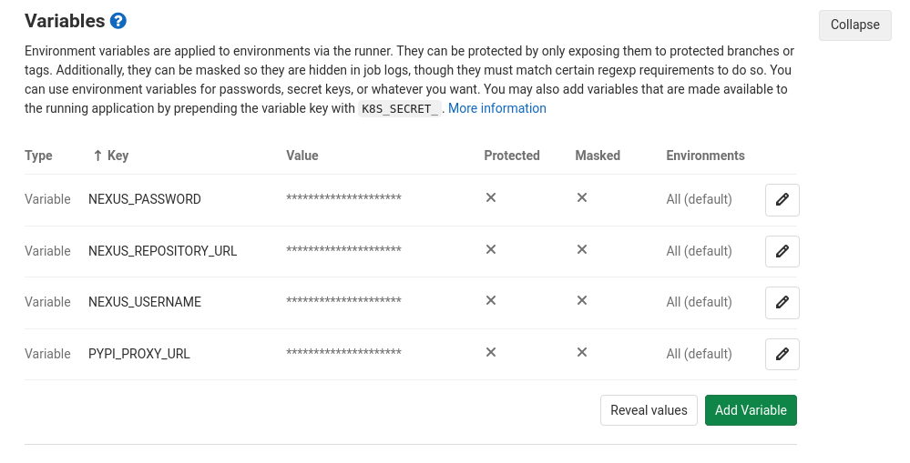

# Code Organization and Continous Integration (CI)

## Structuring Python Projects

* python code can be a short single file (with standard library only)
* modules and packages

### Code Walkthrough: Package miniretry

The miniretry package is a minimal package and demonstrates a project skeleton
and the code, publish and install cycle.

* [Repository](https://github.com/miku/miniretry)
* [PyPI](https://pypi.org/project/miniretry/)

## Virtual environments

* motivation: separate projects and their dependencies

> a self-contained directory tree that contains a Python installation for a
> particular version of Python, plus a number of additional packages

### Basic Usage

```python
$ apt-get install python3-venv
$ python3 -m venv example
$ tree example
$ tree -d example -I "__pycache__"
example
├── bin
├── include
├── lib
│   └── python3.6
│       └── site-packages
│           ├── pip
│           │   ├── commands
│           │   ├── compat
│           │   ├── models
│           │   ├── operations
│           │   ├── req
│           │   ├── utils
│           │   ├── vcs
│           │   └── _vendor
│           ├── pip-9.0.1.dist-info
│           ├── pkg_resources
│           │   ├── extern
│           │   └── _vendor
│           │       └── packaging
│           ├── pkg_resources-0.0.0.dist-info
│           ├── setuptools
│           │   ├── command
│           │   ├── extern
│           │   └── _vendor
│           │       └── packaging
│           └── setuptools-39.0.1.dist-info
├── lib64 -> lib
└── share
    └── python-wheels

29 directories
```

Activation:

```python
$ source example/bin/activate
(example) $
$ which python
[...]/example/bin/python
```

Deactivate:

```python
(example) $ deactivate
$
```

### Virtualenv Helper Scripts

* [virtualenvwrapper](https://virtualenvwrapper.readthedocs.io/en/latest/) is a convenience layer

It needs to be source in the shell startup script, which make a few scripts
available, like `mkvirtualenv`, `rmvirtualenv` or `workon` to switch between
environment.:

### Using Conda

* [docs](https://docs.conda.io/projects/conda/en/latest/user-guide/tasks/manage-environments.html)

```python
$ conda create --name myenv
Collecting package metadata (current_repodata.json): done
Solving environment: done

## Package Plan ##

  environment location: /home/tir/anaconda3/envs/myenv


Proceed ([y]/n)? y

Preparing transaction: done
Verifying transaction: done
Executing transaction: done
#
# To activate this environment, use
#
#     $ conda activate myenv
#
# To deactivate an active environment, use
#
#     $ conda deactivate

```


## Collaboration with git

* the branch-review-merge workflow

A few intermediate aspects of git:

* [gitbits](https://github.com/miku/gitbits)


### Working with hooks

* [commitlint](https://commitlint.js.org/)
* check lint results before committing, reject commit if source code got worse (e.g. require 7/10 or 8/10)
* static check, e.g. via mypy, again, reject commits on failures

## Git and gitlab CI

* gitlab is an open source git repository hosting and CI platfrom
* many CI as a service solutions are available 
* automation potential around testing and deployment

### Example scenario

A python library, that is tested on every commit and deployed on every tag. A
local PyPI conform mirror (e.g. via [Nexus
OSS](https://www.sonatype.com/nexus/repository-oss)), which supports a variety
of build artifacts.

* controlled by a version-controlled file, e.g. `gitlab-ci.yml`

```yaml
image: python:3.8.5-slim-buster

stages:
  - test
  - deploy

before_script:
   - pip install --upgrade pip
   - pip install pytest twine

tests:
  stage: test
  script:
    - pip install backports.csv # try installing this from pypi, nexus may not like the [.]
    - python setup.py develop --index-url $PYPI_PROXY_URL # faster, less load for pypi
    - pytest
  tags: [docker]
  except:
    - tags

upload_to_nexus:
  stage: deploy
  variables:
    TWINE_USERNAME: $NEXUS_USERNAME
    TWINE_PASSWORD: $NEXUS_PASSWORD
  script:
    - python setup.py sdist
    - twine upload --repository-url $NEXUS_REPOSITORY_URL dist/*
  only:
    - tags
  tags: [docker]
```

You can handle credentials in the web interface (settings differ across platforms).




## Packaging Python Applications

* See: [Packaging](Packaging.md)

## Deployment options

* upload to PyPI
* installing the package
* versioning
* automate artifact creation (see: gitlab example)

## Elements of CI: test, build, static code analysis

* CI tools, as service or self-hosted
* Basic gitlab tooling

## Tools

* imports: isort (maybe done by your IDE already)
* code style: black, yapf (editor: format on save)
* readability and static analysis: pylint, prospector, pylava
* repository: tokei, sloccount, git of theseus

### The yapf tool

* yet another python formatter, developed by google

> In essence, the algorithm takes the code and reformats it to the best
> formatting that conforms to the style guide, even if the original code didn't
> violate the style guide. The idea is also similar to the 'gofmt' tool for the
> Go programming language: end all holy wars about formatting - if the whole
> codebase of a project is simply piped through YAPF whenever modifications are
> made, the style remains consistent throughout the project and there's no point
> arguing about style in every code review.

The reference to the Go ecosystem is interesting.

* Go started with a single style guide and this approach has found its ways into
  other languages in the past years.
* While this seems like a small thing to do, it really takes away lots of
  debate, while at the same time improving readability.

* use yapf with your editor

Running it as pre-commit hook or as part of regular code maintenance:

```shell
$ yapf --parallel --in-place --recurse mypackage
```

### The pylint tool

> The Python community has formalized somerecommended programming styles to help
 everyone write code in a common, agreed-upon style that makes the mostsense for
 shared code. This style is captured in PEP 8, the "Style Guide for Python
 Code". Pylint can be a quick andeasy way of seeing if your code has captured
 the essence of PEP 8 and is thereforefriendlyto other potential users

List of messages:

* [http://pylint-messages.wikidot.com/all-codes](http://pylint-messages.wikidot.com/all-codes)

It is possible to ignore particular messages with special comments.

```
# pylint: disable=F0401,C0111,W0232,E1101,R0904,E1103,C0301
```

Configurable via `.pylintrc` file.

The pylint tool emits a single score between 0 and 10, rating the code.

```shell
$ pylint project
...

-----------------------------------
Your code has been rated at 9.37/10
```

### Meta analysers

The [prospector](http://prospector.landscape.io/en/master/) tool includes a
cyclomatic complexity measure (McCabe, 1976).

Example output:

```shell
$ prospector
project/example/some_file.py
  Line: 102
    pylint: redefined-builtin / Redefining built-in 'all' (col 37)
  Line: 163
    pylint: unbalanced-tuple-unpacking / Possible unbalanced tuple unpacking with sequence: left side has 2 label(s), right side has 0 value(s) (col 4)
  Line: 181
    pylint: redefined-builtin / Redefining built-in 'id' (col 4)
  Line: 187
    mccabe: MC0001 / Loop 187 is too complex (29)
  Line: 212
    pylint: redefined-builtin / Redefining built-in 'format' (col 4)
  Line: 215
    pep8: W605 / invalid escape sequence '\.' (col 26)
    pep8: W605 / invalid escape sequence '\s' (col 28)
    pep8: W605 / invalid escape sequence '\d' (col 30)
    pep8: W605 / invalid escape sequence '\s' (col 33)
    pep8: W605 / invalid escape sequence '\s' (col 37)
    pep8: W605 / invalid escape sequence '\d' (col 40)
  Line: 219
```

The [pylava](https://github.com/pylava/pylava) does similar things with a
different, yet overlapping set of tools. The default output is a bit more
compact.

```shell
siskin/sources/vkfilmff.py:103:80: E501 line too long (101 > 79 characters) [pycodestyle]
siskin/database.py:28:1: W0611 'logging' imported but unused [pyflakes]
siskin/database.py:32:1: W0611 'six.moves.urllib.parse' imported but unused [pyflakes]
siskin/database.py:38:80: E501 line too long (84 > 79 characters) [pycodestyle]
siskin/database.py:52:80: E501 line too long (100 > 79 characters) [pycodestyle]
```

### The tokei tool

There are a lot of source code line counters, but I found tokei to be particularly fast.

* [https://github.com/XAMPPRocky/tokei/releases/](https://github.com/XAMPPRocky/tokei/releases/)

```shell
===============================================================================
 Language            Files        Lines         Code     Comments       Blanks
===============================================================================
 Autoconf                8         2652         2038          154          460
 Batch                   3            8            5            2            1
 C Header               16         2540         1429          708          403
 CSS                     1           69           69            0            0
 Dockerfile              1           47           21           19            7
 JSON                    3          132          118            0           14
 Makefile                1           27           19            0            8
 Pan                     2           75           74            1            0
 Python               1104       443745       349100        25715        68930
 ReStructuredText      140        72137        50795            0        21342
 Shell                  16          932          609          134          189
 SVG                    13          613          607            5            1
 Plain Text              6          140            0          130           10
 TOML                    1           32           29            2            1
 YAML                   22          978          837           59           82
-------------------------------------------------------------------------------
 HTML                  109        12786        12084           55          647
 |- CSS                 10          593          327            2          264
 |- JavaScript           5          185          146           19           20
 (Total)                          13564        12557           76          931
-------------------------------------------------------------------------------
 Jupyter Notebooks       1            0            0            0            0
 |- Markdown             1          237            1          184           52
 |- Python               1          210          189            7           14
 (Total)                            447          190          191           66
-------------------------------------------------------------------------------
 Markdown               18         1739            0         1271          468
 |- Python               1           40           36            0            4
 (Total)                           1779           36         1271          472
===============================================================================
 Total                1465       539917       418533        28467        92917
===============================================================================
```

----

Task: If you have not already, install pylint or prospector and run it against
your codebase and get an overview of issues. The output might be noisy, but are
there things, that would be easily changed?

----